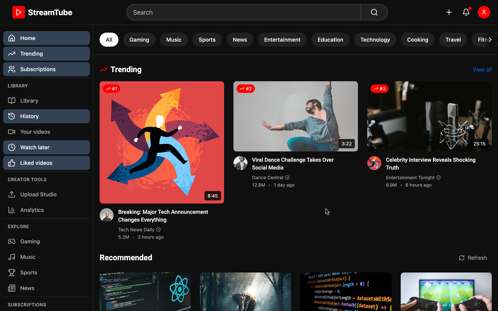
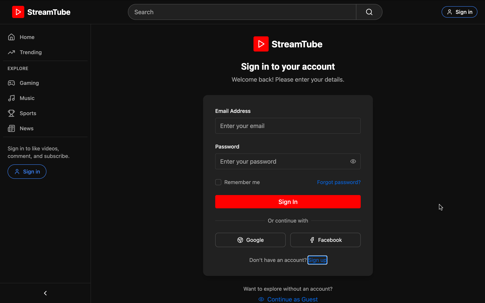
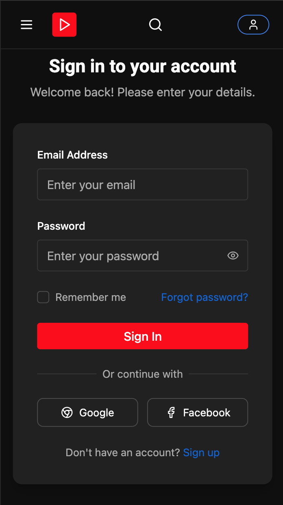
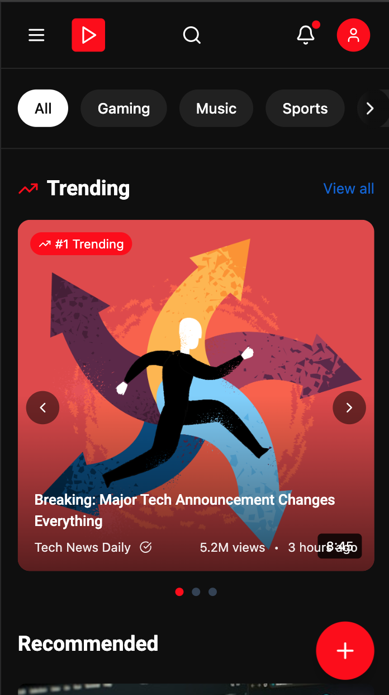

# StreamTube - Full Stack Video Platform (YouTube Clone)

StreamTube is a full-stack video management and sharing platform inspired by YouTube. Built with the MERN stack (MongoDB, Express.js, React.js, Node.js), it allows users to upload, view, and interact with videos. The project is organized into two main folders:

- `backend/` — Node.js/Express API server (handles authentication, video management, comments, etc.)
- `frontend/` — React.js client (user interface, video player, dashboard, etc.)



<p align="center">
    
    
</p>


# Installation Guide
**Here is the Complete Installation guide of this project.**

## Clone the repository
```shell
git clone https://github.com/devwithsumit/StreamTube
cd streamtube
```

## Requirements
- [Node.js](https://nodejs.org/en/download)
- [MongoDB](https://www.mongodb.com/docs/manual/administration/install-community/)

## Project Structure

### Main folder
```
/Stream_Tube
  ├── backend/    # Express.js API server
  └── frontend/   # React.js client
```
### Frontend
```
frontend/
├── public/             # Static assets
├── src/
│   ├── components/     # Reusable UI components
│   ├── pages/          # Page components
│   ├── styles/         # Global styles and Tailwind configuration
│   ├── App.jsx         # Main application component
│   ├── Routes.jsx      # Application routes
│   └── index.jsx       # Application entry point
├── .env                # Environment variables
├── index.html          # HTML template
└── package.json        # Project dependencies and scripts
```
### backend 
```
backend/
├── src/
│   ├── connection/     # connection configurations (mongo db)
│   ├── controllers/    # Route controllers logic
│   ├── middlewares/    # Middleware logic
│   ├── models          # Schema models
│   ├── routes          # Routes handler
│   └── utils           # Utility functions
├── .env                # Environment variables
├── app.js              # Main Server code
└── package.json        # Project dependencies and scripts
```

## Renaming the env files (`/streamtube`)
Now rename env files from .env.example to .env,
```shell
cd frontend
mv .env.example .env
cd ..
cd backend
mv .env.example .env
cd ..
```
You can also manually rename `.env` files after opening this project in the VS Code or any other code editor.


## Backend Setup (`backend/`)

1. **Navigate to the backend folder:**
   ```sh
   cd backend
   ```
2. **Copy and configure environment variables:**
   - If not present, create a `.env` file in the `backend/` directory. Example:
     ```env
     PORT=3000
     MONGO_URI=mongodb://localhost:27017/streamTube
     JWT_SECRET=your_jwt_secret
     ```
3. **Install dependencies:**
   ```sh
   npm install
   ```
4. **Start the backend server:**
   ```sh
   # for production: changes in the code will update in the server only after running once again 
   npm start
   # for Developement: server re-runs on every update in the code
   npx nodemon app.js
   ```
   The backend server will run on the port specified in your `.env` file (default: 3000).


## Frontend Setup (`frontend/`)

1. **Open a new terminal and navigate to the frontend folder:**
   ```sh
   cd frontend
   ```
2. **Install dependencies:**
   ```sh
   npm install
   ```
3. **Start the frontend development server:**
   ```sh
   npm run dev
   ```
   The frontend will run on [http://localhost:4000](http://localhost:4000) by default.\
    If you want to change the PORT manually update the `package.json` file
    ```json
    //...
    "scripts": {
        "dev": "vite --port=4000", //change port='your_port_number' 
        //...
    }
    ```

## Usage
- Make sure both backend and frontend servers are running.
- Open your browser and go to [http://localhost:4000](http://localhost:4000) to use the application.


## License
MIT